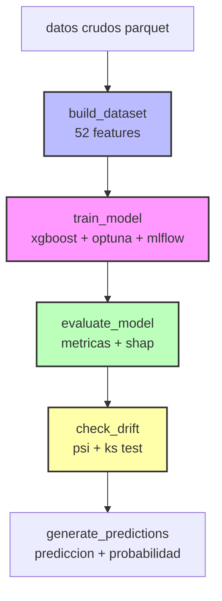

# implementacion completa del pipeline sodai

## resumen ejecutivo

se implemento un pipeline de ml completo y productivo que incluye:

- **xgboost** clasificador binario con soporte nativo para features categoricas
- **mlflow** para tracking de experimentos y versionado de modelos
- **optuna** para optimizacion automatica de hiperparametros (10 trials)
- **shap** para interpretabilidad y explicabilidad del modelo
- **deteccion de drift** con metricas estadisticas (psi, ks test)
- **52 features** diseñadas: 27 numericas, 10 categoricas, 5 binarias

**ultima ejecucion exitosa**: `manual__2025-11-19T23:49:04+00:00`
**metricas del modelo**: f1=0.7190, roc-auc=0.8438, recall=0.8855, precision=0.6052

## arquitectura del sistema

### diagrama de flujo



### representacion visual en airflow ui

**vista del dag en airflow:**


*captura del grafico del dag mostrando todas las tareas y sus dependencias*

**ejecucion exitosa:**


*ejecucion completa del pipeline con reentrenamiento por deteccion de drift*

## componentes implementados

### 1. mlflow integration

**archivo**: `dags/sodai/mlflow_utils.py`

funcionalidades:
- configuracion automatica del tracking uri
- registro de parametros y metricas
- guardado de modelos con sklearn
- recuperacion del mejor modelo

**beneficios**:
- trazabilidad completa de experimentos
- comparacion de diferentes runs
- versionado automatico de modelos
- reproducibilidad garantizada

### 2. optimizacion con optuna

**archivo**: `dags/sodai/train.py`

implementacion:
- espacio de busqueda para xgboost clasificador:
  - n_estimators: [50, 300]
  - max_depth: [3, 15]
  - learning_rate: [0.01, 0.3]
  - min_child_weight: [1, 10]
  - gamma: [0, 0.5]
  - subsample: [0.5, 1.0]
  - colsample_bytree: [0.5, 1.0]
  - colsample_bylevel: [0.5, 1.0]
  - reg_alpha: [0, 10]
  - reg_lambda: [0, 10]
  - scale_pos_weight: calculado automaticamente del desbalance de clases

- validacion cruzada (cv=3) para evaluar cada trial
- maximizacion de f1-score
- 10 trials por defecto (configurable)
- enable_categorical=True para manejo nativo de categoricas

**metricas registradas en mlflow**:
- accuracy, precision, recall, f1-score, roc-auc en test set
- best_cv_f1 de optuna
- hiperparametros finales optimizados
- feature importance basada en gain
- categorical mappings para features categoricas

### 3. interpretabilidad con shap

**archivo**: `dags/sodai/evaluate.py`

graficos generados:
1. **summary plot**: resumen visual de importancia de features
2. **feature importance plot**: ranking de features por shap values
3. **dependence plots**: relacion entre feature y prediccion (top 3)

artefactos guardados:
- `shap_values.pkl`: valores shap para analisis posterior
- `shap_summary.png`: grafico resumen
- `shap_feature_importance.png`: importancia de features
- `shap_dependence_*.png`: plots de dependencia

**configuracion**:
- usa muestra de 500 observaciones (configurable)
- treexplainer optimizado para xgboost
- backend agg para entorno servidor sin gui
- maneja features categoricas correctamente

### 4. deteccion de drift

**archivo**: `dags/sodai/drift.py`

metricas implementadas:

**psi (population stability index)**:
- divide datos en bins
- compara distribuciones entre referencia y actual
- umbral: 0.2 (configurable en config.py)

interpretacion psi:
- < 0.1: sin cambio
- 0.1 - 0.2: cambio moderado
- >= 0.2: drift detectado

**ks test (kolmogorov-smirnov)**:
- mide maxima diferencia entre cdfs
- p_value < 0.05: distribuciones diferentes
- ks_stat > 0.2: diferencia relevante

**decision de reentrenamiento**:
```python
drift_detectado = (psi >= 0.2) or (ks_stat > 0.2 and p_value < 0.05)
```

### 5. dag lineal con pipeline completo

**archivo**: `dags/sodai_pipeline_dag.py`

**tasks ejecutadas en secuencia**:

1. **build_dataset**: construye dataset de modelado con 52 features (27 numericas, 10 categoricas, 5 binarias)
2. **train_model**: entrena modelo xgboost con optimizacion optuna y tracking mlflow
3. **evaluate_model**: evalua modelo con metricas de clasificacion y genera analisis shap
4. **check_drift**: detecta drift usando psi y ks test comparando con dataset anterior
5. **generate_predictions**: genera predicciones binarias y probabilidades para dataset actual

**flujo de dependencias**:
```
build_dataset → train_model → evaluate_model → check_drift → generate_predictions
```

**caracteristicas**:
- pipeline completamente reproducible
- cada tarea guarda artefactos en `artifacts/`
- comunicacion via xcoms para pasar rutas de archivos
- logging detallado en cada etapa

## estructura de artifacts

```
artifacts/
├── datasets/
│   └── df_modelado.parquet
├── models/
│   └── sodai_model.joblib
├── metrics/
│   └── sodai_metrics.json
├── drift/
│   └── drift_report.json
├── shap/
│   ├── shap_values.pkl
│   ├── shap_summary.png
│   ├── shap_feature_importance.png
│   └── shap_dependence_*.png
├── predictions/
│   └── predicciones.parquet
└── mlruns/
    └── [experimentos mlflow]
```

## configuracion

**archivo**: `dags/sodai/config.py`

variables principales:
```python
MLFLOW_TRACKING_URI = "file:///opt/airflow/artifacts/mlruns"
MLFLOW_EXPERIMENT_NAME = "sodai_model_training"
DRIFT_THRESHOLD_PSI = 0.2
```

## como ejecutar el pipeline

### primera ejecucion

1. acceder a interfaz airflow: http://localhost:8080
2. activar dag `sodai_training_and_scoring`
3. ejecutar manualmente con boton "play"
4. el pipeline ejecutara secuencialmente:
   - construir dataset con 52 features
   - entrenar modelo xgboost con optuna (10 trials)
   - evaluar modelo y generar analisis shap
   - detectar drift (sin referencia inicial, usara dataset actual)
   - generar predicciones con probabilidades

**duracion aproximada**: 7 minutos

### ejecuciones posteriores (con datos nuevos)

1. reemplazar archivos parquet en `airflow/data/`:
   - clientes.parquet (nuevos clientes o actualizaciones)
   - productos.parquet (nuevo catalogo o cambios)
   - transacciones.parquet (nuevas ventas)

2. ejecutar dag nuevamente desde airflow ui
3. el pipeline:
   - construira nuevo dataset con misma ingenieria de features
   - reentrenara modelo con nuevos datos usando optuna
   - registrara experimento en mlflow con run id unico
   - evaluara modelo y calculara metricas actualizadas
   - comparara distribuciones con dataset anterior (drift detection)
   - generara nuevas predicciones sobre datos actuales

**nota**: el pipeline siempre reentrena el modelo para garantizar que use los datos mas recientes. el drift detection sirve para monitoreo y alertas, pero no bloquea el reentrenamiento.

## metricas y monitoreo

### metricas en mlflow

acceder a mlflow ui:
```bash
cd Laboratorios-MDS/Entrega 2/airflow
mlflow ui --backend-store-uri file://./artifacts/mlruns --port 5000
```

visualizar:
- comparacion de runs
- evolucion de metricas
- hiperparametros probados
- graficos de feature importance

### reporte de drift

archivo: `artifacts/drift/drift_report.json`

contiene:
```json
{
  "psi_promedio": 0.15,
  "drift_detectado": true,
  "requiere_reentrenamiento": true,
  "columnas_drift": {
    "customer_id": {
      "psi": 0.18,
      "ks_statistic": 0.12,
      "drift_detectado": false
    }
  }
}
